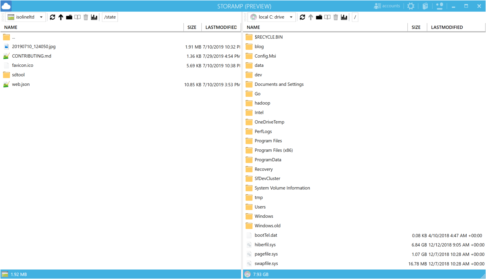

# StorAMP

StorAmp is a *free* cloud storage explorer that supports variety of cloud providers:

StorAMP is a FREE cloud storage explorer that supports variety of cloud providers:
- Azure Blob Storage
- Azure Data Lake (Gen 1)
- Azure Data Lake (Gen 2) **coming soon**
- Amazon S3
- Azure Databricks DBFS
- Azure Key Vault
- Local disk
- Temporary storage

Fast, native Windows application, downloadable from the Windows 10 Store:

