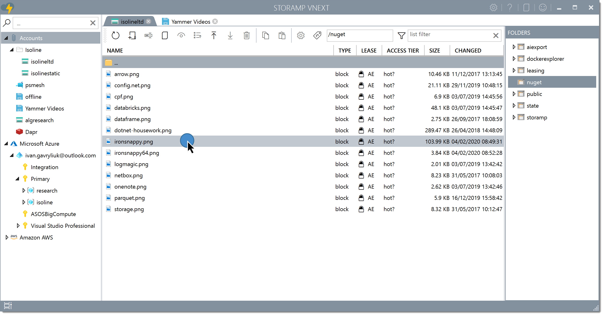

# StorAMP

StorAMP is a **free** and **open-source** cloud storage explorer that supports variety of cloud providers:
- [Azure Blob Storage](https://docs.microsoft.com/en-gb/azure/storage/blobs/storage-blobs-introduction)
- [Azure File Storage](https://docs.microsoft.com/en-gb/azure/storage/files/storage-files-introduction)
- Azure Data Lake Storage ([Gen 1](https://docs.microsoft.com/en-us/azure/data-lake-store/data-lake-store-overview) and [Gen 2](https://docs.microsoft.com/en-us/azure/storage/blobs/data-lake-storage-introduction))
- [Amazon S3](https://aws.amazon.com/s3/)
- [Google Cloud Storage](https://cloud.google.com/storage/)
- [Azure Key Vault](https://azure.microsoft.com/en-us/services/key-vault/)
- Local disk
- Temporary in-memory storage

Fast, native Windows application, downloadable from the Windows 10 Store:

By installing from Windows 10 Store you get automatic updates, sandboxed application (it can't damage your system or write where it's not supposed to - it simply doesn't have permissions to do so) and it just feels nice and safe.

Main features:

- Native and fast. Uses about 5 times less RAM and is about 10 times faster than competitors.
- Ergonomic. All the operations are as fast and click-less as possible, based on personal experience and frustration with competitive UIs.
- Unified Interface. All storage providers feel and look the same, in terms of visual looks, operations and speed.
- Built-in editors for most text formats (json, yaml, csv, txt, xml, cs, java, rb, php etc.) that open files instantly in one click, and allow to edit and save in a single click.
- Built-in editors support reformatting badly formatted json and xml files.
- Built-in video player that understands most of the video formats (mp4, wmv etc.)
- Extra customisations specific to concrete cloud storage, i.e.:
  - Working with Azure Blob Storage adds features like viewing access tier, lease, performing leasing operations, changing access, getting shared access signature and so on.
- Supports automatic discovery of Microsoft Azure resources.