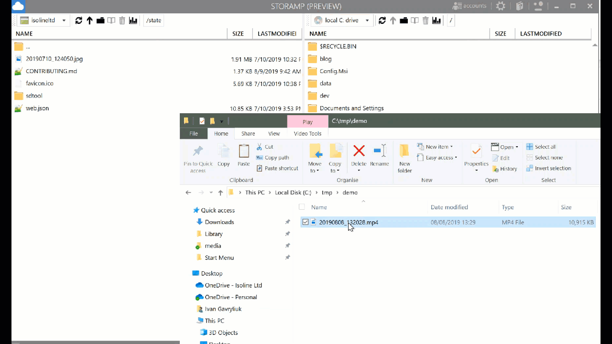

# StorAMP

StorAMP is a FREE cloud storage explorer that supports variety of cloud providers:
- Azure Blob Storage
- Azure Data Lake (Gen 1 and Gen 2)
- Azure Data Lake
- Amazon S3 buckets
- Azure Databricks DBFS (read-only mode, read-write support is coming)
- Azure Key Vault
- Local disk
- Temporary storage

Fast, native Windows application, downloadable from the Windows 10 Store:

By installing from Windows 10 Store you get automatic updates, sandboxed application (it can't damange your system or write where it's not supposed to - it simply doesn't have permissions to do so) and it just feels nice and safe.

What can you do with StorAmp? Here is a brief list of features.

## Fast Navigation Experience
You can view any storage account folders and files in a Norton Commander style view. It's blazing fast unlike any Electron based viewers.

## Viewing and Editing Files Inline
StorAMP allows you to view files inline, without downloading them locally. Just press the "view" button on the toolbar. In addition to that, you can edit the file as well.

It supports syntax highlighting for most popular file formats i.e. markdown, json, xml, css, html, most programming languages (C#, Java, JavaScript (not sure it's a programming language), Scala and many others). If you like us to support more, just raise an issue here.

## Drag and Drop from Windows Explorer to Upload Files

It's as easy as that, just drag a file or set of files to upload them to the storage.

## Drag and Drop between storage panes

Same goes for copying files between storage accounts - simply drag'n'drop.

Want to suggest another feature? Please raise an issue here.

# Release Log

## v1.0.2
- "about" page got a bit more style and information.
- minor bugfixes

## v1.0.1 (06/08/2019)
Mostly adjustments to Microsoft Store publishing.

## v1.0.0 (05/08/2019)
The first release to Microsoft Store, very early preview
